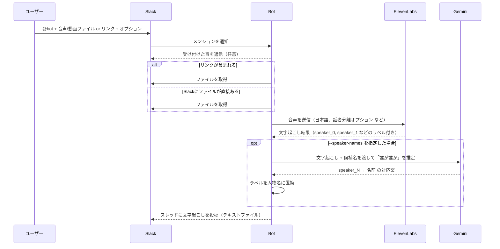

# ElevenLabs Transcribe Bot for Slack & Discord

[ElevenLabs Scribe API](https://elevenlabs.io/speech-to-text) を使って音声・動画ファイルを文字起こしするマルチプラットフォーム Bot です。Slack と Discord の両方に対応しています。Deno で実装され、Google Cloud Run 上で動作します。

## 機能

- **マルチプラットフォーム対応:** Slack と Discord の両方で動作
- メンション or スラッシュコマンドで送られた音声・動画ファイルを文字起こし
- **Google Drive・YouTube 連携:** Google Drive のファイルリンクや YouTube URL からの文字起こしに対応
- **話者識別 (diarization):** 会話中の異なる話者を識別
- **タイムスタンプ自動付与:** 発話位置のナビゲーション用にタイムスタンプを付ける
- **音声イベント検出:** 音楽・笑い声などの音声イベントを検出
- **柔軟な出力:** 文字起こし結果をテキストファイルとしてスレッドに返却

## 文字起こしオプション

Bot をメンションする際にオプションを追加してカスタマイズできます：

- `--no-diarize` — 話者識別を無効化（デフォルト: 有効）
- `--no-timestamp` — タイムスタンプを無効化（デフォルト: 有効）
- `--no-audio-events` — 音声イベント検出を無効化（デフォルト: 有効）
- `--num-speakers N` — 話者数を指定（1〜32、話者識別有効時のデフォルト: 2）
- `--speaker-names "<name1>,<name2>"` — 話者名を指定（AI が誰がどの speaker かを自動的に推定）

例：

```
@bot transcribe this file --no-timestamp --no-diarize
@bot transcribe this file --num-speakers 3
@bot https://drive.google.com/file/d/xxxxx/view --num-speakers 4
@bot transcribe this file --speaker-names "田中,山田"
```

**注意：**

- `--num-speakers` は話者識別が有効な時のみ機能します。`--no-diarize` を指定すると `--num-speakers` は無視されます。
- `--speaker-names` は会話内容を Google Gemini に渡して話者を自動推定します。この機能を使うには `GOOGLE_GENERATIVE_AI_API_KEY` を環境変数にセットする必要があります。

## プロジェクト構成

```
src/
├── index.ts          # メインエントリーポイント、リクエストルーティング
├── slack-handler.ts  # Slack イベントハンドラ
├── discord-handler.ts # Discord インタラクションハンドラ
├── scribe.ts         # ElevenLabs Scribe API 連携
├── slack.ts          # Slack API ユーティリティ
├── discord.ts        # Discord API ユーティリティ
├── types.ts          # TypeScript 型定義
└── utils.ts          # テキスト処理用ヘルパー
```

## 技術スタック

- [Deno](https://deno.land/) — JavaScript/TypeScript ランタイム
- [Google Cloud Run](https://cloud.google.com/run) — コンテナホスティング
- [ElevenLabs Scribe API](https://elevenlabs.io/docs/api-reference/speech-to-text) — 音声認識
- Slack Events API — Slack Bot のイベント処理
- Discord Interactions API — Discord Bot のインタラクション処理

## セットアップ

### 前提条件

- [Deno](https://deno.land/manual/getting_started/installation) がインストール済み
- [Google Cloud SDK](https://cloud.google.com/sdk/docs/install) がインストール済み
- ElevenLabs アカウントと API キー
- Cloud Run が有効な Google Cloud プロジェクト
- Slack アプリ（Bot トークンと署名シークレット、Slack Bot 用）
- Discord アプリ（Bot トークンと公開鍵、Discord Bot 用）

### 1. リポジトリを clone

```bash
git clone <repository-url>
cd <repository-name>
```

### 2. 環境変数の設定

プロジェクトルートに `.env` ファイルを作成し、以下を記載します：

```
ELEVENLABS_API_KEY="your-elevenlabs-api-key"
SLACK_BOT_TOKEN="your-slack-bot-token"
DISCORD_APPLICATION_ID="your-discord-app-id"
DISCORD_PUBLIC_KEY="your-discord-public-key"
DISCORD_BOT_TOKEN="your-discord-bot-token"
GOOGLE_SERVICE_ACCOUNT_KEY='{"type":"service_account","project_id":"..."}'  # Google サービスアカウント JSON

# YouTube cookies（オプション、一部の動画で必要）
# Cloud Run 用：cookies ファイル内容を Base64 エンコードしたもの
YOUTUBE_COOKIES_BASE64="base64-encoded-cookies-content"
# ローカル / コンテナ用：cookies ファイルへのパス
# YOUTUBE_COOKIES="/path/to/cookies.txt"
```

### 3. Cloud Run へデプロイ

Bot を Google Cloud Run にデプロイします：

```bash
make deploy
```

または手動で：

```bash
gcloud run deploy scribe-bot \
  --source . \
  --region asia-northeast1 \
  --allow-unauthenticated
```

### 4. Slack アプリの設定

1. https://api.slack.com/apps で新規 Slack アプリを作成
2. 「OAuth & Permissions」で以下の Bot Token Scope を追加：
   - `app_mentions:read` — Bot がメンションされたことを検知
   - `files:read` — ファイル情報の読み取り
   - `files:write` — 文字起こしファイルのアップロード
   - `chat:write` — メッセージ送信
3. Workspace にインストールし、Bot User OAuth Token をコピー
4. 「Event Subscriptions」でイベントを有効化
5. Request URL に Cloud Run の URL を設定：
   ```
   https://YOUR-CLOUD-RUN-URL/slack/events
   ```
6. 以下の Bot イベントを購読：
   - `app_mention` — Bot がファイル付きでメンションされたことを検知
7. 「Basic Information」から Signing Secret をコピー

### 5. Discord Bot の設定

1. https://discord.com/developers/applications で新規 Discord アプリを作成
2. 「Bot」セクションで Bot を作成
3. Bot Token をコピー（`DISCORD_BOT_TOKEN` に使用）
4. 「General Information」から以下をコピー：
   - Application ID（`DISCORD_APPLICATION_ID` 用）
   - Public Key（`DISCORD_PUBLIC_KEY` 用）
5. 「Interactions Endpoint URL」に以下を設定：
   ```
   https://YOUR-CLOUD-RUN-URL/discord/interactions
   ```
6. 「Bot」セクションで以下の Privileged Gateway Intents を有効化：
   - MESSAGE CONTENT INTENT（メッセージ本文の読み取り）
7. 「OAuth2 > URL Generator」で以下の権限の招待 URL を生成：
   - Scopes: `bot`, `applications.commands`
   - Bot Permissions: `Send Messages`, `Attach Files`, `Read Message History`
8. 生成された URL から Bot を Discord サーバーに招待
9. スラッシュコマンドを登録：
   ```bash
   npm run register-discord-commands
   ```

Cloud Run の URL は `gcloud run deploy` の出力、または Google Cloud Console で確認できます。

## 使い方

### Slack

#### ファイルアップロードで使う：

1. Slack チャンネルに音声・動画ファイルをアップロード
2. 同じメッセージ or リプライで Bot をメンション
3. （任意）`--no-timestamp` や `--no-diarize` などのオプションを追加
4. Bot がファイルを処理し、文字起こしのテキストファイルを返信

#### Google Drive / YouTube リンクで使う：

1. メッセージに Google Drive の動画 / 音声ファイルのリンクを貼る
   - YouTube の場合は動画 URL を貼り付け
2. 同じメッセージで Bot をメンション
3. （任意）オプションを追加
4. Bot が Google Drive / YouTube からダウンロードして文字起こし

例: `@bot https://drive.google.com/file/d/xxxxx/view --num-speakers 3`
例: `@bot https://www.youtube.com/watch?v=xxxxxxx --no-timestamp`

**注意:** 一部の YouTube 動画はダウンロードに認証 cookie が必要です。下記「YouTube Cookies のセットアップ」を参照してください。

### Discord

#### スラッシュコマンドで使う：

1. 任意のチャンネルで `/transcribe` コマンドを使用
2. 音声・動画ファイルをコマンドに添付
3. （任意）パラメータでオプションを追加
4. Bot が文字起こしをテキストファイルで返信

#### ファイルアップロードで使う：

1. Discord チャンネルに音声・動画ファイルをアップロード
2. そのメッセージにリプライで `/transcribe` コマンドを使用
3. （任意）オプションを追加
4. Bot が処理して文字起こしを返却

#### Google Drive / YouTube リンクで使う：

1. `/transcribe url:<drive_link>` コマンドを使用（YouTube URL も可）
2. （任意）パラメータでオプションを追加
3. Bot がダウンロードして文字起こし

例: `/transcribe url:https://drive.google.com/file/d/xxxxx/view speakers:3`
例: `/transcribe url:https://www.youtube.com/watch?v=xxxxxxx`

**注意:** 一部の YouTube 動画はダウンロードに認証 cookie が必要です。下記「YouTube Cookies のセットアップ」を参照してください。

## YouTube Cookies のセットアップ

YouTube 動画の文字起こしで「Sign in to confirm you're not a bot」エラーが出る場合は、認証 cookie を提供する必要があります。

### なぜ Cloud Run でこのエラーが出るのか（ローカルでは出ないのに）

このエラーは、ローカル Mac よりも Cloud Run などのクラウド環境で起こりやすいです。理由：

1. **IP アドレスのレピュテーション**:
   - **Cloud Run**: データセンターの共用 IP を使うので、YouTube の Bot 検出システムにフラグされやすい
   - **あなたの Mac**: 家庭・オフィスの IP は通常のユーザートラフィックとして信頼される

2. **アクセスパターン**:
   - **Cloud Run**: サーバー環境からの自動リクエストは怪しまれやすい
   - **あなたの Mac**: 手動コマンドは普通のユーザー行動に見える

3. **ネットワーク環境**:
   - データセンターは過去にスクレイピングが多く、リスクが高いと判定される
   - 家庭ネットワークは人間ユーザーと結び付けられている

**解決策**: YouTube cookie を提供することでログイン済みユーザーとしてリクエストが認証され、匿名 Bot トラフィックではなく正規のアクセスとして扱われます。

### YouTube Cookie の取得方法

#### 方法 1: ブラウザ拡張機能（推奨）

最も簡単で確実な方法です：

**Chrome / Edge の場合:**

1. Chrome ウェブストアから「Get cookies.txt LOCALLY」拡張機能をインストール
2. ブラウザで YouTube (https://www.youtube.com) を開き、**ログイン状態であることを確認**
3. ツールバーの拡張機能アイコンをクリック
4. 「Export」をクリック → 拡張機能が cookie を Netscape 形式で自動フォーマット
5. `cookies.txt` として保存（拡張機能が自動でやってくれることが多い）
6. ファイルが Downloads フォルダにダウンロードされる

**Firefox の場合:**

1. Firefox Add-ons から「cookies.txt」拡張機能をインストール
2. YouTube (https://www.youtube.com) を開き、**ログイン状態であることを確認**
3. 拡張機能アイコンをクリック
4. 「Export」をクリック → `cookies.txt` として保存

**重要**: cookie をエクスポートする前に必ず **YouTube にログイン**しておいてください。ログインしていないと認証情報が含まれません。

#### 方法 2: yt-dlp を直接使う

ローカルに `yt-dlp` がインストール済みなら、ブラウザから直接 cookie を抽出できます：

```bash
# Chrome から抽出（一般的）
yt-dlp --cookies-from-browser chrome --print "%(title)s" "https://www.youtube.com/watch?v=VIDEO_ID"

# Firefox から抽出
yt-dlp --cookies-from-browser firefox --print "%(title)s" "https://www.youtube.com/watch?v=VIDEO_ID"

# Safari から抽出（macOS）
yt-dlp --cookies-from-browser safari --print "%(title)s" "https://www.youtube.com/watch?v=VIDEO_ID"
```

cookie をファイルに保存する場合：

```bash
# ブラウザの cookie を使うが、cookies.txt 自体は手動エクスポートが必要
# 実際の cookies.txt ファイルを得るにはブラウザ拡張の方法が楽
```

**注意**: 方法 2 はブラウザが YouTube にログイン済みである必要があります。実際の cookies.txt ファイルを得たい場合はブラウザ拡張（方法 1）の方が簡単で確実です。

### Cloud Run デプロイ用

1. cookie を `cookies.txt` ファイルにエクスポート（上記参照）
2. ファイル内容を Base64 エンコード：
   ```bash
   base64 -i cookies.txt -o cookies_base64.txt
   # macOS の場合:
   base64 cookies.txt > cookies_base64.txt
   ```
3. Base64 エンコード済みの内容を Cloud Run の環境変数に追加：

   ```bash
   gcloud run services update scribe-bot \
     --region asia-northeast1 \
     --set-env-vars YOUTUBE_COOKIES_BASE64="$(cat cookies_base64.txt)"
   ```

   または `.env` ファイルに追加：

   ```
   YOUTUBE_COOKIES_BASE64="<ここに Base64 内容を貼り付け>"
   ```

### ローカル / コンテナ利用

ローカルやコンテナでファイルアクセス可能な場合：

1. `cookies.txt` をプロジェクトディレクトリかコンテナ内に配置
2. 環境変数を設定：
   ```
   YOUTUBE_COOKIES="/path/to/cookies.txt"
   ```

**重要事項：**

- **Cookie の有効期限**: YouTube cookie は通常数ヶ月（6〜8ヶ月程度）で失効します。失効すると同じ「Sign in to confirm you're not a bot」エラーが再発します。
- **Cookie の更新方法**: 失効した cookie をリフレッシュするには：
  1. ブラウザから cookie を再エクスポート（「YouTube Cookie の取得方法」参照）
  2. 新しい cookies ファイルを Base64 エンコード
  3. Cloud Run の `YOUTUBE_COOKIES_BASE64` 環境変数を更新：
     ```bash
     gcloud run services update scribe-bot \
       --region asia-northeast1 \
       --update-env-vars YOUTUBE_COOKIES_BASE64="$(cat cookies_base64.txt)"
     ```
  4. または `.env` を更新して再デプロイ
- **モニタリング**: 動いていたのに突然認証エラーが出始めたら、cookie 失効の可能性が高いです。
- **セキュリティ**: cookies ファイルは大切に管理し、絶対にバージョン管理にコミットしないでください。
- **コンプライアンス**: cookie の利用は YouTube の利用規約を遵守すること。

### 対応ファイル形式

- 音声: MP3, WAV, M4A, AAC, OGG, WebM
- 動画: MP4, MOV, AVI, MPEG, WebM

### 出力フォーマット

オプションによって出力形式が変わります：

**話者識別あり（デフォルト）:**

```
[0:00] speaker_0: こんにちは、今日の会議を始めます。
[0:05] speaker_1: よろしくお願いします。
```

**話者識別なし:**

```
[0:00] こんにちは、今日の会議を始めます。
[0:05] よろしくお願いします。
```

**タイムスタンプなし:**

```
speaker_0: こんにちは、今日の会議を始めます。
speaker_1: よろしくお願いします。
```

## Slackでの文字起こしフロー

非エンジニア向けの説明です。登場人物は「ユーザー」「Slack」「Bot」「ElevenLabs」「Gemini」です。

### 全体シーケンス (Mermaid)



## 話者識別（ダイアリゼーション）の仕組みと制約

- **段階1: ElevenLabsの話者分離**
  - ElevenLabs Scribeが音声を解析し、発話をタイムスタンプ付きのトークン列に分解します。
  - diarize有効時は、各発話に `speaker_0`, `speaker_1`, ... のようなラベルが付きます。
  - `--num-speakers` を指定すると、モデルへのヒントとして話者数を渡します（誤った数を渡すと精度が落ちる可能性があります）。

- **段階2: ラベル→人物名の推定（任意）**
  - `--speaker-names "田中,山田"` のように候補名を与えた場合のみ実行されます。
  - Botが文字起こし内容（語彙、一人称、呼称、文脈など）を **Gemini** に渡し、`speaker_N` と候補名の対応を推定します。
  - これは音の特徴から個人を特定するものではなく、テキストだけを根拠にした推測です。候補名リストにない名前は使いません。

### 重要な注意点（正確さの限界）

- **話者名の確定は厳密ではありません。** ElevenLabsの話者分離は強力ですが、`speaker_0`→実在の人物名の割当は
  Geminiによるテキスト推論のため、誤割当（入れ替わり・混在）が起こり得ます。
- **候補名の質と数に依存します。** 候補が多すぎる／似た役割の人が多いと誤りが増えます。できるだけ必要最小限の候補に絞ると良いです。
- **`--num-speakers` の誤指定は悪影響。** 実際より多い/少ない話者数を指定すると分離と整形の両方に影響します。
- **完全な音声話者認識ではありません。** 声質そのものから個人を同定する処理は行っていません。
